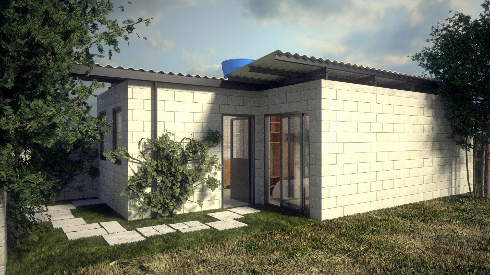
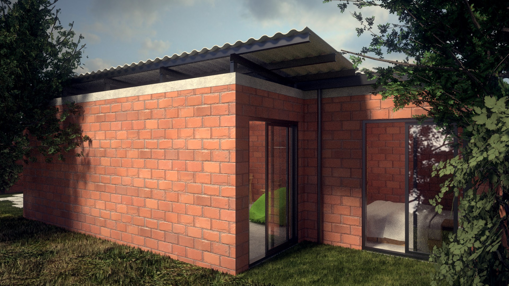
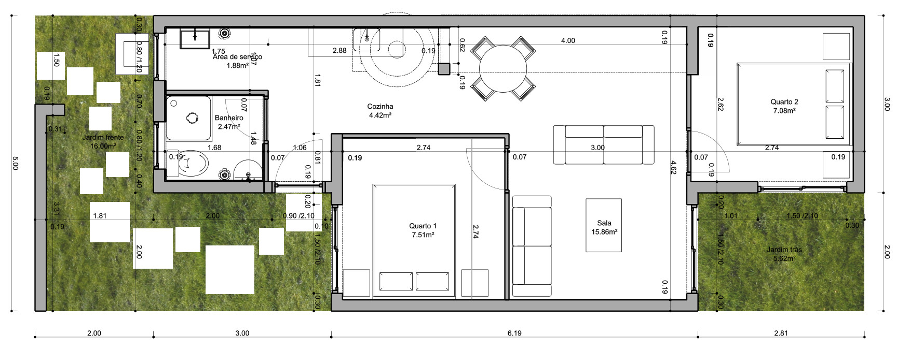
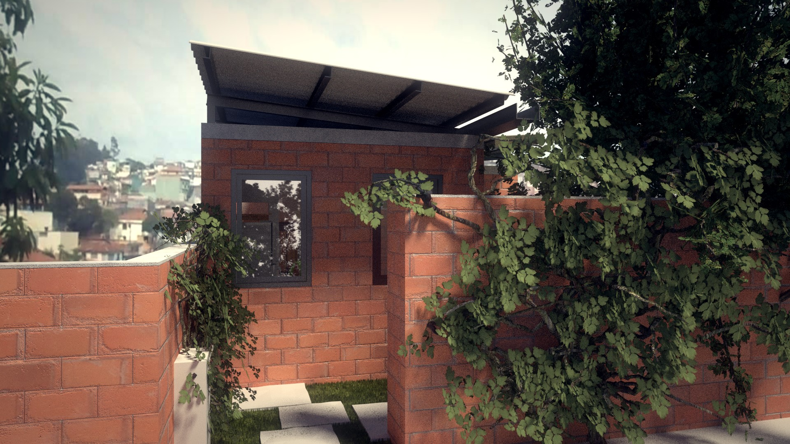
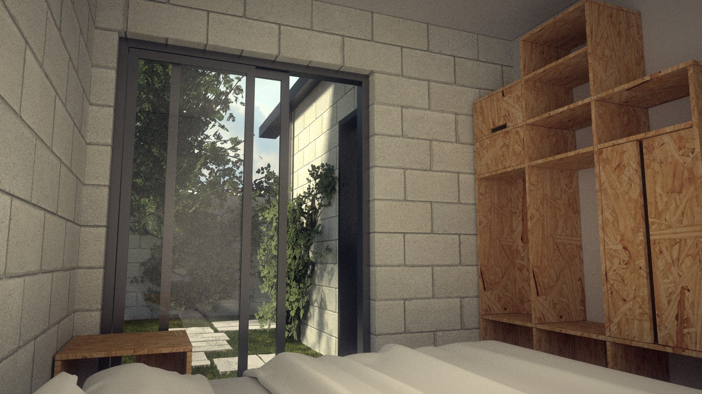

# Max-min house

## How did we get here?

The concept of "social housing" always disturbed us. As if "pure" housing was something else, as if social housing was an exception to the rule (we are mainly talking about Brazil here). But what books call social housing is actually where most of the people live. Why give a special name to something that is common? From now on, we will only talk about housing. As it should be. Dignified and for anybody.

This is a reflection about the incremental housing concept, used by Chilean architect [Alejandro Aravena](https://en.wikipedia.org/wiki/Alejandro_Aravena), that can be explained like this: "With half a budget, instead of doing a house that is half-good, half-bad, let's do half a good house, where the owner can do the other half later".

This is our journey. As architects and as dwellers. As people who want a city with more equal opportunities for eveybody. This project was thought to be a real experience. Not only as a project, but how it behaves day after day. The most important question for this to become real is: How much does it cost to do it the way we want?

What is the maximum we can do with a minimal cost? What are the solutions most adapted to existing financing options? Find the equilibrium. Begin from the budget.

## Max-min house

Our search is for a practical and quality solution, that can be easily executed and that allow to reduce the initial costs to facilitate the financing. We started from two ideas inspired by Aravena to build our "half a good house" project and reduce costs:

1. The house can be expanded

2. Part of the finishing can be done later

This is a pilot project. It is developed to be the starting point for other ideas, be adapted case by case, terrain by terrain, family by family.

We started using a 70 m² terrain, which is small, but a very common size in peripheral neighbourhoods of São Paulo and areas that were favelas (slums) before. It is of course possible to use bigger terrains (or smaller), but using a small terrain gives a better investment. This means that it is possible to use a better terrain, more expensive, but localised closer to urban equipment and facilities like schools, shops, jobs, etc. It is important to keep in mind that "a good house" depends half on the house itself, half on where this house is situated.

This house is not social housing, it is a house for anybody interested in building something with quality, for a cheap price, and ready to make some concessions.

It has, in principle, 50 m². We consider 50 m² as a good quality-cost balance, which is of course very relative: For some it can feel small, but many housing units are much smaller. The[PMCMV](http://www.minhacasaminhavida.gov.br/) (Programa Minha Casa Minha Vida) program specified a minimum of 41 m², but many housing units in the centre of São Paulo  have much less, even when targeting people with high income (in the central region, a known real-estate company is currently selling 18 m² units).

O projeto inclui fundações já calculadas para que no futuro possua um andar superior, o que pode aumentá-lo para até 100m². Para isso, a laje já é recortada para a escada. A cobertura é desmontável e pode ser reaproveitada em cima do andar superior quando o mesmo for construído. 

The roof is also separated from the slab, with good ventilation, to not transmit the heat, which is the best possible thermal insulation.

We began the project with the [budget scheduling](https://github.com/uncreatednet/casa-economica/blob/master/or%C3%A7amento%20modelo%2001.ods), which should stay in constant evolution. The house costs, in its minimal but fully habitable version, less than 55 000 BRL. Together with the design files, we are providing the full budget estimation spreadsheet. We used several public sources like [SINAPI, and prices from PMSP and FDE-SP](http://www.uncreated.net/priceapi/webprice.py), which are indicated in the spreadsheet. All these prices can be revised and changed, allowing anyone to adapt the prices to what is available in his/her city and know precisely how much it will cost. In this estimation, we also used systematically the highest prices available, to avoid bad surprises later. So this house might cost less than that.

With 55 000 BRL, it has everything that is commonly included in a new house: Infrastructure, piping, equipment, good electrical installation, etc. There are large windows, which don't raise the price much. Therefore, even on a small terrain, light can enter everywhere, wherever possible. All the more expensive part of the possible upper floor is already included: Foundations, slabs, and the place for the stairs.

As we wrote earlier, to save money, in this version, some parts are left to be done later. Most of the walls don't have finishing. Only the kitchen, service area and bathroom have ceramics on the walls. This saves more than 5 000 BRL. Finishing can be dome later, but it can also be left as is. The project is thought to work without the need for any finishing.

Another possible big saving is, instead of building a single house, to build more than one next to each other, so one of the side walls can be shared with a neighbour.

It could be built with CMU blocks or ceramic masonry. The pice is almost the same and the properties are similar. The ceramic masonry breathes better, which betters the atmosphere inside the house. There are more possibilities we didn't explore yet, such as CEB blocks.

The price of the house without any of these savings is 67 000 BRL. But it is also possible to lower the price well below 55 000 BRL, for example by self-building some parts, which saves labour costs. This is by no means an impossible task, many ways to learn exist.

If this is house is given to a construction company to build, the cost will be much higher, because of the indirect costs of the company like transport, employees, etc and the profit of the company itself. These indirect costs can today add around 30% to the building costs.

This project is fully [open source](https://github.com/uncreatednet/casa-economica). All the project files can be downloaded, used and modified by anyone. But it also allows other people to bring ideas and make the project better. Feel at home to join and discuss.

See more:

* [full budget esimation](https://github.com/uncreatednet/casa-economica/blob/master/or%C3%A7amento%20modelo%2001.ods)
* [3D files (BIM)](https://github.com/uncreatednet/casa-economica/blob/master/modelo%2001.FCStd)
* [images](https://github.com/uncreatednet/casa-economica/tree/master/render)
