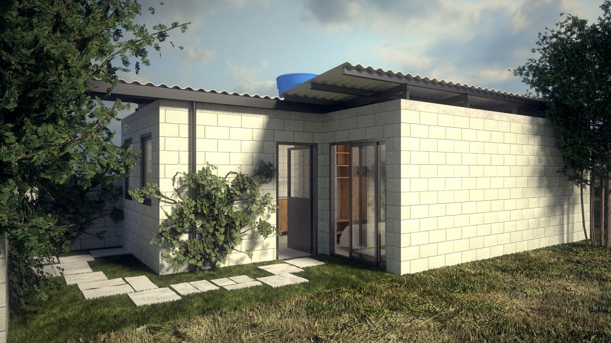
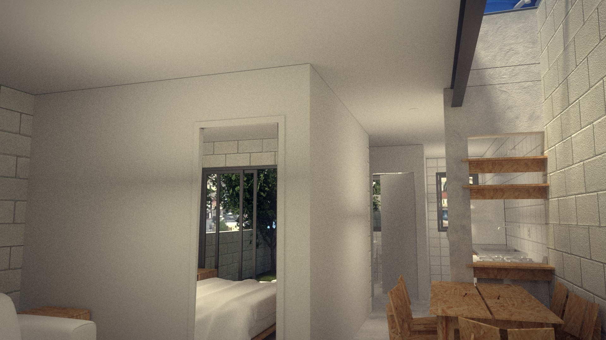
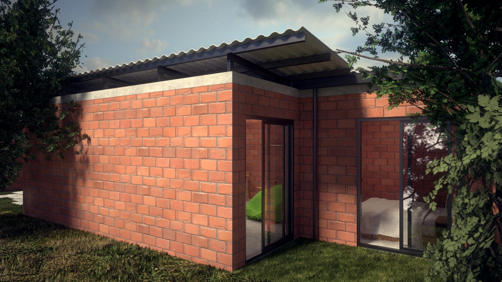
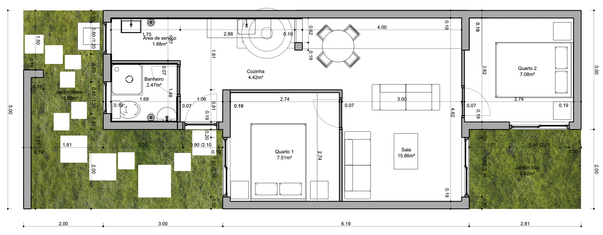
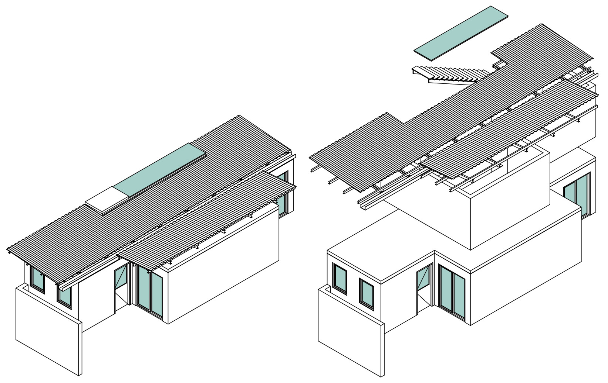
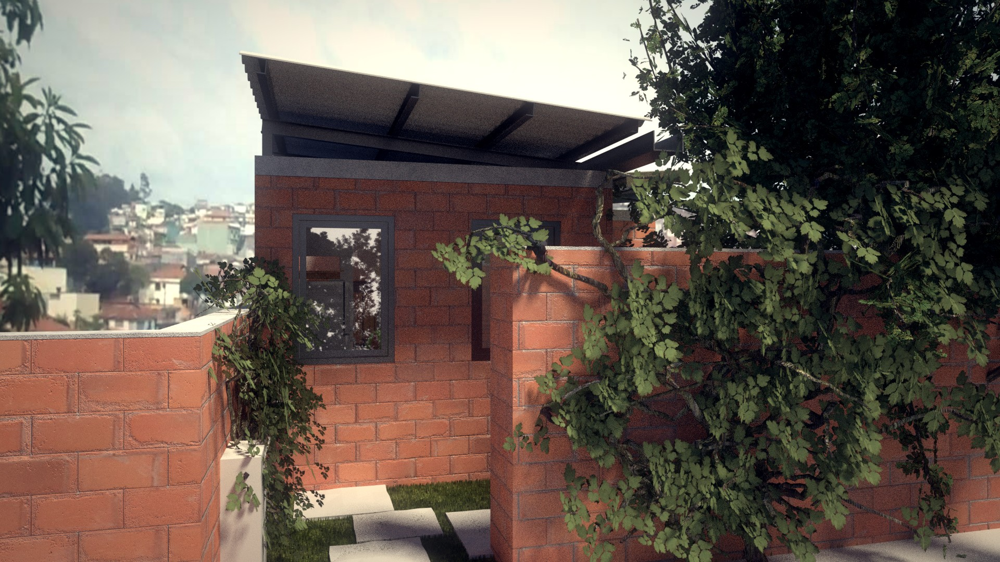
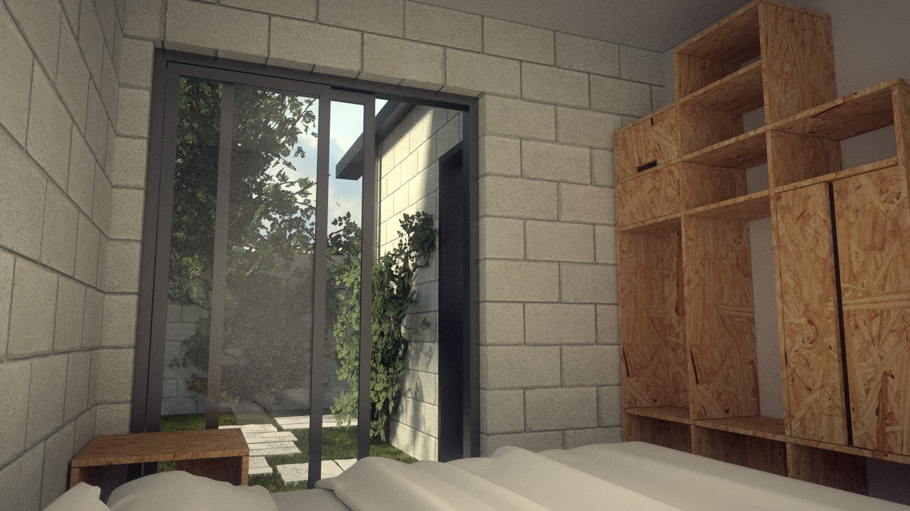
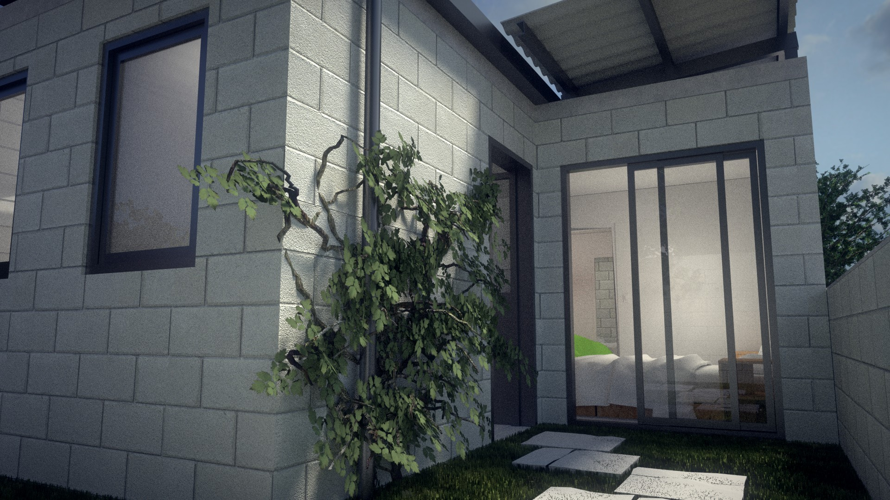

# Casa max-min

## Como chegamos ate aqui?

Sempre nos incomodou o conceito de habitação "social". Como se habitação pura fosse outra coisa, como se a habitação "social" fosse uma exceção e não a regra (falamos em Brasil). Mas o que os livros chamam de habitação social é onde vive a maioria das pessoas. Então por que dar um nome especial ao que é o corriqueiro? Pois bem, daqui em diante trataremos apenas de habitação. Como deve ser. Digna e para todos.

Este é uma reflexão nossa sobre o conceito de casa incremental, usado pelo arquiteto chileno [Alejandro Aravena](https://en.wikipedia.org/wiki/Alejandro_Aravena), que pode ser resumido assim: “Com um orçamento pela metade, em vez de fazer uma casa meio boa meio ruim, vamos fazer uma meia-casa boa, onde o morador possa completar a outra metade depois”.

Essa é a nossa jornada. Enquanto arquitetos e enquanto moradores. Enquanto pessoas que desejam uma cidade com oportunidades mais igualitárias para todos. Esse projeto foi feito para ser uma experiência real. Não apenas um projeto, mas como ele se comporta no dia a dia. O mais importante para isso é saber: quanto custa para fazer o que queremos e precisamos?

Qual o máximo que podemos fazer com um mínimo de custo? Quais seriam as soluções mais adaptadas aos financiamentos existentes? Encontrar o equilíbrio. Iniciar pelo orçamento. 

## Casa max-min

Nossa busca foi por uma solução urbana, pratica e de qualidade, que pudesse ser executada facilmente e que permitisse reduzir os custos iniciais para facilitar o financiamento. Partimos de duas ideias inspiradas pelo Aravena para montar o nosso projeto de meia casa "boa" e economizar custos:

1. A casa pode ser aumentada.

2. Parte do acabamento é feita posteriormente.

Esse projeto é um projeto piloto. Ele foi desenvolvido para ser o ponto de partida para outras ideias, ser adaptado caso a caso, terreno a terreno, família a família. É uma casa pensada para cidades, onde o terreno é caro.

Decidimos por utilizar um terreno de 70 m², que é pequeno, mas é um tamanho bem comum nos bairros mais periféricos de São Paulo e nas áreas que eram favelas antigamente. Podemos utilizar posteriormente terrenos maiores ou menores, mas construir em um terreno menor permite, em ultimo caso, um maior investimento no mesmo. Isso significa poder utilizar um terreno mais valorizado, com mais acesso aos equipamentos e facilidades urbanas. É importante lembrar que morar bem é feito 50% pela casa propriamente dita e 50% do local onde se mora.

Essa casa não é uma casa de interesse social, é uma casa para todos aqueles que estejam interessados em construir com qualidade economizando muito e estejam dispostos a fazer algumas concessões. 

Ela tem, a princípio, 50m². Consideramos 50m² um bom custo-benefício, o que é muito relativo: para alguns pode ser pouco, mas muitas habitações são muito menores. O [PMCMV](http://www.minhacasaminhavida.gov.br/) (Programa Minha Casa Minha Vida) tinha como mínimo 41 m², mas muitos empreendimentos no centro da cidade de São Paulo possuem muito menos, mesmo os idealizados para pessoas de alta renda (na região central, uma construtora conhecida está, neste momento, vendendo apartamentos de 18m²).

O projeto inclui fundações já calculadas para que no futuro possua um andar superior, o que pode aumentá-lo para até 100m². Para isso, a laje já é recortada para a escada. A cobertura é desmontável e pode ser reaproveitada em cima do andar superior quando o mesmo for construído. 

A cobertura também é descolada da laje, com ampla ventilação, para não transmitir o calor, melhorando o isolamento térmico.

Começamos o projeto dessa casa pelo [orçamento](https://github.com/uncreatednet/casa-economica/blob/master/or%C3%A7amento%20modelo%2001.ods), o qual pretendemos que esteja em constante evolução. Ela custa, em sua versão mínima porem completamente habitável, menos de R$ 55 000. Em conjunto com os arquivos de desenho do projeto, estamos disponibilizando um arquivo com a tabela do orçamento. Usamos como fonte o [SINAPI, os preços da PMSP, do FDE-SP](http://www.uncreated.net/priceapi/webprice.py) e outras fontes publicas, discriminadas a cada item. Todos esses campos podem ser trocados, permitindo que cada um pegue essa listagem em sua cidade e consiga saber quanto que uma casa como essa poderia custar.  Para chegarmos a esse preço, usamos os preços mais altos que encontramos, o que significa que provavelmente ela custara menos que isso, mas queríamos evitar surpresas desagradáveis.

Com R$ 55 000, ela tem tudo que normalmente é entregue em uma casa nova: Infraestrutura, encanamento, equipamentos, instalação elétrica boa, etc. Tem muitas janelas, pois o aumento de custo é pouco. Assim, apesar do terreno pequeno, a luz é captada por todo lugar, por onde for possível. Também toda a parte mais cara para a construção do segundo andar já esta incluída: as fundações, as lajes e o local da escada.

Como falamos anteriormente, para economizar, nessa versão deixamos algumas partes para serem feitas posteriormente. As paredes em geral não possuem acabamento. Apenas na cozinha, área de serviço e banheiro foi previsto acabamento cerâmico. Isso economiza mais de R$ 5000. O acabamento pode ser feito depois, mas também pode ser deixado assim. Foi pensado para funcionar muito bem sem qualquer acabamento.

Uma outra grande economia possível, em vez de construir uma casa só, é construir mais de uma, e dessa maneira, compartilhar uma das paredes laterais com um vizinho.

Ela pode ser construída com blocos de concreto ou cerâmicos. O preço é quase o mesmo e as propriedades, similares. O bloco cerâmico respira melhor, o que melhora a atmosfera dentro da casa. Existem também outras possibilidades que ainda não exploramos, como o tijolo de solo-cimento.

O valor da casa sem economia nenhuma é R$ 67 000. Mas também é possível diminuir o preço bem abaixo de R$ 55 000, por exemplo fazendo algumas partes si mesmo, economizando mão de obra. Não é nenhuma tarefa impossível, existem muitas maneiras de aprender.

Caso seja construída  com construtora, o valor ficara bem mais alto por causa dos custos indiretos da construtora, como transporte, funcionários, mestre de obra, etc, e que incluem também o lucro da empresa. Essas despesas indiretas hoje em dia podem chegar em torno de 30% do valor da obra.

Esse projeto é totalmente [open source](https://github.com/uncreatednet/casa-economica). Todos os arquivos podem ser baixados, usados e modificados por quem quiser. Mas também permite que outras pessoas tragam ideias e que o projeto melhore. Sinta-se a vontade para agregar e discutir.

Veja mais:

* [orçamento completo](https://github.com/uncreatednet/casa-economica/blob/master/or%C3%A7amento%20modelo%2001.ods)
* [arquivo 3D (BIM)](https://github.com/uncreatednet/casa-economica/blob/master/modelo%2001.FCStd)
* [imagens](https://github.com/uncreatednet/casa-economica/tree/master/render)
